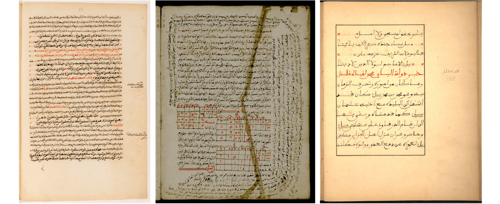
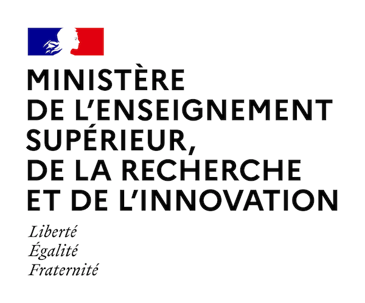
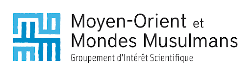
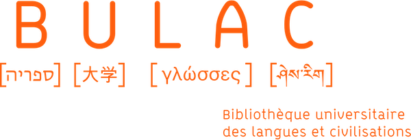

# RASAM dataset
An Open Dataset for the Recognition and Analysis of Scripts in Arabic Maghrebi

## How to cite

RASAM 1 has been presented during the ICDAR 2021 conference (ASAR workshop). To cite this work and this dataset, please use the following informations:

```latex
@InProceedings{2021rasam-dataset,
author="Vidal-Gorène, Chahan and Lucas, Noëmie and Salah, Clément and Decours-Perez, Aliénor and Dupin, Boris",
editor="Barney Smith, Elisa H. and Pal, Umapada",
title="RASAM -- A Dataset for the Recognition and Analysis of Scripts in Arabic Maghrebi",
booktitle="Document Analysis and Recognition -- ICDAR 2021 Workshops",
year="2021",
publisher="Springer International Publishing",
address="Cham",
pages="265--281",
isbn="978-3-030-86198-8"
}
```

Link to [the paper](https://link.springer.com/chapter/10.1007%2F978-3-030-86198-8_19).

RASAM 1 has been extended with RASAM 2, presented during CHR 2024 conference. To cite this work and this dataset, please use the following informations:

```latex
@inproceedings{2024rasam-dataset,
  title = {{Enhancing Arabic Maghribi Handwritten Text Recognition with RASAM 2: A Comprehensive Dataset and Benchmarking}},
  author = {Vidal-Gor{\`e}ne, Chahan and Salah, Cl{\'e}ment and Lucas, No{\"e}mie and Decours-Perez, Ali{\'e}nor and Perrier, Antoine},
  url = {https://enc.hal.science/hal-04722622},
  booktile = {{Computational Humanities Research (CHR)}},
  address = {Aarhus, Denmark},
  editor = {CEUR-WS},
  volume = {3834},
  pages = {200-216},
  year = {2024},
  month = Dec,
}
```


## RASAM 1 description

This repository contains the ground truth of the RASAM dataset, introduced at the 4th workshop on Arabic and derived Script Analysis and Recognition of ICDAR 2021 (ASAR workshop).
The dataset is the result of the collaborative hackathon "Artificial intelligence and khaṭṭ maghribī" organized by [Research Consortium Middle-East and Muslim Worlds (GIS MOMM)](http://majlis-remomm.fr) and [Calfa](https://calfa.fr), held from January to April 2021 at [BULAC](https://www.bulac.fr) (Paris). It covers a representative part of the handwritten production in Arabic Maghrebi scripts and proposes to provide a reference dataset for the training of HTR models for these under-resourced scripts.
 
In the paper, we shed light on specifities of the Arabic Maghrebi scripts and manuscripts, and highlight their recognition’s challenges. We propose an assessment of collaborative tools for data creation and evaluate layout and HTR models.
 
The Dataset is made up of 300 images, with their related ground truth stored in a XML file (pageXML format).
Images come from three manuscripts selected among the collections of the BULAC: two manuscripts belong to the historical genre (MS.ARA.1977 and MS.AR.417) and the third one has to do with inheritance law (MS.ARA.609). Please refer to the paper for details about the manuscripts and the Arabic Maghrebi scripts. 
You will find paleographical details in the [contributing.md](contributing.md) file, with tables devoted to paleographical specificities of the considered manuscripts.

<figure>
    
    <figcaption>MS.ARA.1977 (p.42), MS.ARA.609 (p.124) and MS.ARA.417 (f. 12v)</figcaption>
</figure>
 
Three levels of annotation have been considered: text-regions, baselines and texts. Specifications for transcription have been decided collectively (see paper for exhaustive list of specifications). The annotation was carried out with the [Calfa Vision](https://vision.calfa.fr) platform.

## Images

Images are available through the IIIF server of the BULAC Library. For the list of images ID, see the [list-images.tsv](list-images.tsv) file.
To request an image, please use the following URL template:

```
https://bina.bulac.fr/iiif/2/{image_ID}/full/{width,height}/0/default.jpg
```

## Contributing and Specifications for annotation

You have identified a typo or a mistake in the layout annotation or in the transcription? First off, thanks for taking the time to contribute!
Please check the [contributing.md](contributing.md) file and follow the specifications established for transcription in order to keep the dataset homogeneity and facilitate the proofreading work of the team. Please open an issue in case of doubt.

## Hackathon team

**Project managers**

* Noëmie Lucas (EHESS / CNRS)
* Chahan Vidal-Gorène (Calfa / École Nationale des Chartes-PSL)

**Contributors**

* Clément Salah (Sorbonne-Université / Université de Lausanne)
* Élise Voguet (IRHT / CNRS)
* Esma Larbi
* Zélie Lepinay (Université Paris 1 – Panthéon-Sorbonne)
* Zohra Azgal (EPHE-PSL)
* Jennifer Vanz (UMR 8167)
* Mathilde Boudier (Université Paris 1 – Panthéon-Sorbonne / UMR 8167 Islam médiéval)

## Version History

* 1.1
  * Minor typos and BL corrections
  * Additions of complementary images
* 1.0
  * Initial Release

## License

This project is licensed under the Apache License 2.0 - see the LICENSE.md file for details.

## Acknowledgments

This work was carried out with the financial support of the French Ministry of Higher Education, Research and Innovation. It is in line with the scienjpgic focus on digital humanities defined by the Research Consortium Middle-East and Muslim Worlds (GIS MOMM). We would also like to thank all the transcribers and people who took part in the hackathon and ensured its successful completion.

    